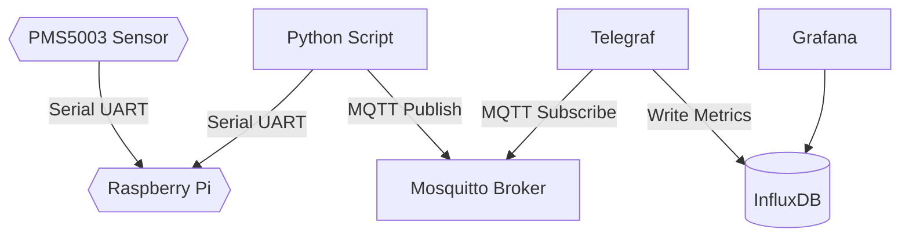

# PMS5003 Particulate Sensor with a Raspberry Pi 4+ / Zero 2

This repo contains Ansible config files for installing libraries and supporting software for using the Plantower PMS5003 Particulate Sensor ([link](https://www.plantower.com/en/products_33/74.html)) with a Raspberry Pi 4+ or Zero 2.

The Ansible config installs the accompanying `PMS5003-python` library from Pimoroni and the following supporting software:

- Mosquitto - MQTT Broker
- Telegraf - Data collector
- InfluxDB - Data store
- Grafana - Dashboarding
- A custom Python script that uses `PMS5003-python` and publishes measurements to MQTT.

Schematically these components work together in the following way:



## Prerequisites

- Compatible Raspberry Pi (4+ / Zero 2)*
- Enable UART on the Raspberry, add `dtoverlay=pi3-miniuart-bt` to `/boot/firmware/config.txt`
- SSH to connect to the Raspberry
- Ansible


To install all components, run:

```
ansible-playbook -i ansible/inventory.ini ansible/playbook.yml --ask-vault-pass
```

The playbook installs a Systemd service that automatically starts the Python script at startup.

**This playbook has been tested with a Raspberry Pi 4 and a Raspberry Pi Zero 2 W, in combination with Raspberry Pi OS (64-bit) and Raspberry Pi OS Lite (64-bit), both based on Debian 12 Bookworm*

# Sources

Ansible
- https://tomsitcafe.com/2023/02/15/creating-an-ansible-role-from-a-playbook-modular-reusable-code/
- https://4sysops.com/archives/encrypt-and-decrypt-with-ansible-vault/

Influx / Telegraf / MQTT
- https://www.influxdata.com/blog/deploying-influxdb-with-ansible/ 
- https://www.influxdata.com/blog/docker-monitoring-tutorial-telegraf-influxdb/
- https://github.com/influxdata/telegraf/blob/master/plugins/inputs/mqtt_consumer/README.md

PMS5003
- https://github.com/pimoroni/pms5003-python
- https://www.petersplanet.nl/index.php/2021/08/22/airquality-with-raspberry-pi/
